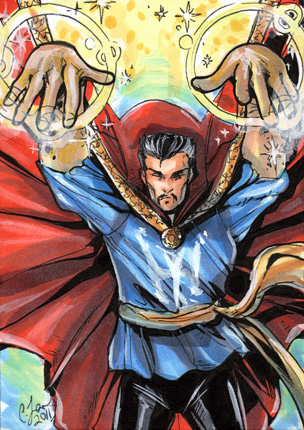

When I think of software engineering, I think back to the days as a kid when I thought things that should be impossible were brought to life through magic. Magic in a sense is much like that of software engineering. Where a magician awes the audience with masterful misdirection and sleight-of-hand, a software engineer brings a client's wishes to life by designing software. That aspect of designing something usable and sustainable from an idea in one's head is what drew me into the computer science field and to pursue software engineering. As Walt Disney once said, *"If you can dream it, you can do it."*

Watching a magician do their trick for the first time is amazing. Your mind races with both excitement and wonder as you contemplate how they could perform such a feat. Software is much the same when you look at it through the eyes of the user. But looking through the eyes of the magician, lots of hard work goes into designing the trick and performing it flawlessly. Thus a software engineer's job is to design, create, and execute a piece of software that does what it's intended to do in a way that can awe the user much like magicians awe their audience. 

As I take courses in Computer Science and Software Engineering, I hope to one day enter the realm of making the impossible, possible.
I'd like to develop the skills to design and implement my own software that can help people in their daily lives and on a global scale. I know that with the skills I acquire, I could inspire other generations to change the world through technology. But before that day comes, I shall put forth great effort in the small steps I take.

Sources: [Day 4 - Magic Kingdom](https://www.flickr.com/photos/loimere/5068068920/) by [Derek Hatfield](https://www.flickr.com/photos/loimere/) is licensed under [CC BY 2.0](https://creativecommons.org/licenses/by/2.0/)

[Magic! ;-)](https://www.flickr.com/photos/peronimo/15085636609/) by [Per Gosche] is licensed under [CC BY 2.0](https://creativecommons.org/licenses/by/2.0/)

[Doctor Strange sketch card](http://cassandrajames.deviantart.com/art/Doctor-Strange-sketch-card-208649132) by [CassandraJames](http://cassandrajames.deviantart.com/)
