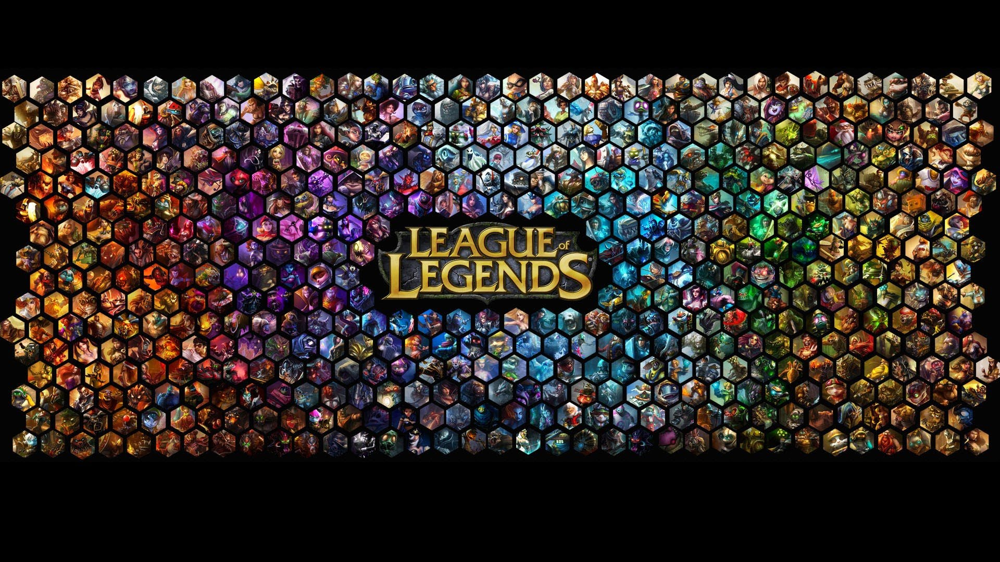

The League of Legends Beginner's Guide was a project I made in my senior year of high school as part of my ITGS class. The aim of the project was to consult with a client to design and implement a real-world application using technology mediums to address either a problem or a desired application. The result of the project was a beginner's guide video to an online video game called League of Legends. The video was then posted onto Youtube to provide a way for my client to view the video and for others that may be in his shoes, to also view the video. 

My endeavor began when my client who was my friend wanted to get into the popular online video game craze that is League of Legends. He wasn't sure where to begin as the game itself is large and ever evolving with patches and updates that change how the game is played. Thus I broke down the elements of the game into pieces began to collect in-game footage to use for my video. This process took over 12+ hours to record multiple games, compress their size, and edit their length. Once the video was made, I placed my own dialogue over the video to explain the parts of the game. I then added text over so that my client and other viewers could read the content being presented to them as well as viewing and listening. 

Overall I think the project was a great success. My client greatly enjoyed the ease of having the information compiled into a simple video. The video at the time of posting had upwards of 500 views. Today the video has 100+ likes and 13,900+ views. Of course the video may be considered obsolete as the game has greatly evolved in the 4 year difference. However I am quite proud of what I had accomplished.

The video can be viewed below.

Sources: (https://www.youtube.com/watch?v=Uu0OSaHgr_0)
(https://i.ytimg.com/vi/1MbhGwXJhdc/maxresdefault.jpg)
(https://upload.wikimedia.org/wikipedia/en/7/77/League_of_Legends_logo.png)

